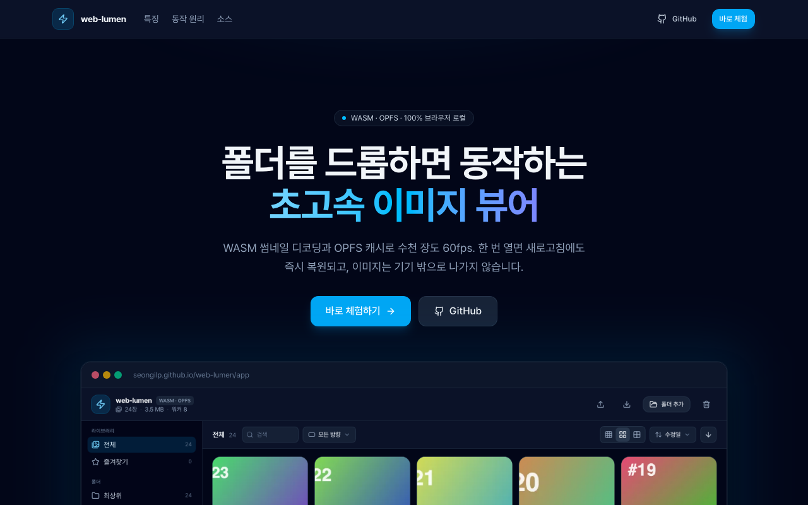
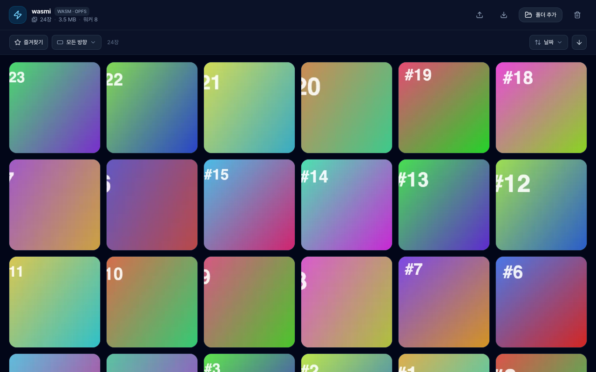
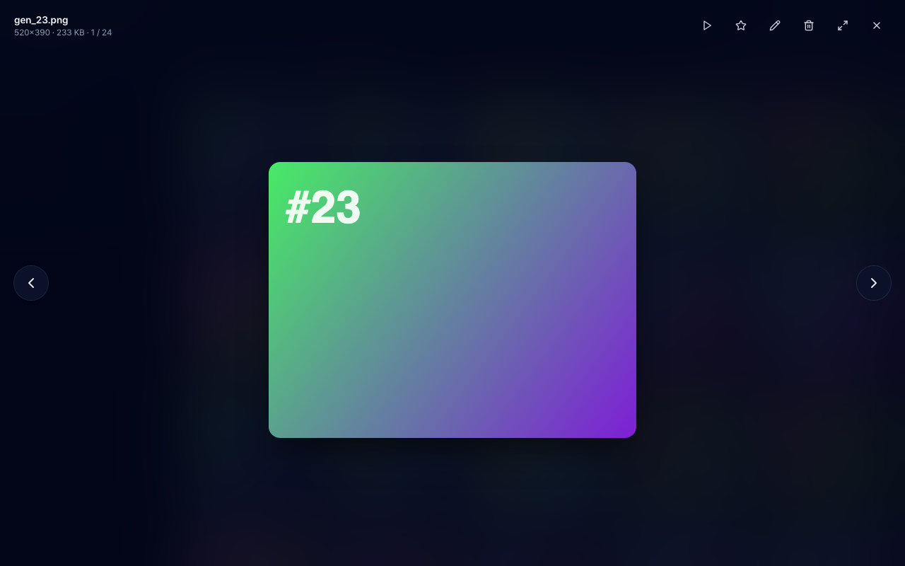

# wasmi · WASM Image Viewer

폴더를 드롭하면 동작하는 초고속 이미지 뷰어. **WASM** 썸네일 디코딩 + **OPFS** 캐시로,
한 번 연 폴더는 새로고침해도 즉시 복원됩니다.

### 🔗 라이브 데모

- **랜딩**: https://seongilp.github.io/wasmi/
- **뷰어(바로 체험)**: https://seongilp.github.io/wasmi/app/

[](https://seongilp.github.io/wasmi/)

<p align="center"><sub>↑ 랜딩 페이지 — 클릭하면 라이브로 이동</sub></p>

### 스크린샷

| 그리드 (가상 스크롤) | 원본 라이트박스 |
| --- | --- |
| [](https://seongilp.github.io/wasmi/app/) | [](https://seongilp.github.io/wasmi/app/) |

WASM으로 디코딩한 썸네일이 깔린 그리드(좌), OPFS에서 풀해상도 원본을 불러오는 라이트박스(우).

## 핵심 기술

| 영역 | 구현 |
| --- | --- |
| **WASM** | AssemblyScript로 작성한 area-average(box filter) 다운스케일러 + dominant color 계산. Web Worker 안에서 디코딩된 RGBA를 받아 썸네일을 생성한다. (`assembly/index.ts`) |
| **OPFS** | 썸네일·원본·매니페스트를 Origin Private File System에 저장. 재방문 시 매니페스트만 읽어 그리드를 즉시 복원하고, 원본은 라이트박스에서 스트림으로 연다. (`src/lib/opfs.ts`) |
| **폴더 드롭** | `webkitGetAsEntry`로 중첩 폴더까지 재귀 수집. File System Access `showDirectoryPicker` 폴백 지원. (`src/lib/collect.ts`) |
| **초고속 렌더** | CPU 코어 수만큼의 워커 풀 + 윈도잉(가상 스크롤) 그리드. 수천 장도 60fps. (`src/lib/thumb-pool.ts`, `src/components/Grid.tsx`) |
| **사이드바 · 컬렉션** | 좌측 사이드바로 전체/즐겨찾기/폴더/컬렉션 탐색. 썸네일을 컬렉션·즐겨찾기로 **드래그**해 정리. 컬렉션 목록·소속을 OPFS에 영속화. (`src/components/Sidebar.tsx`, `src/lib/useLibrary.ts`) |
| **다중 선택 · 일괄 작업** | 체크박스/⌘·Shift-클릭으로 여러 장 선택 → 컬렉션 담기·즐겨찾기·삭제 일괄 처리, 여러 장 한 번에 드래그. (`src/components/SelectionBar.tsx`) |
| **정렬·분류·즐겨찾기** | 날짜/이름/크기/해상도 정렬, 방향 필터. (`src/lib/view.ts`, `src/components/ControlBar.tsx`) |
| **중복 제거** | 콘텐츠 서명(동일 파일) + WASM dHash 지각 해시(유사 이미지) 감지. (`src/lib/dedup.ts`) |
| **원본 삭제** | **폴더 선택**(File System Access)으로 열면 확인 후 **디스크 원본까지 영구 삭제**. 디렉토리 핸들을 IndexedDB에 저장해 **새로고침 후에도** 원본 삭제 가능(권한 재요청). 드래그드롭은 목록·캐시에서만 제거. (`src/lib/collect.ts`, `src/lib/handle-store.ts`) |
| **이름변경** | 라이트박스에서 파일명 더블클릭 → 인라인 편집. 폴더 선택으로 연 경우 `FileSystemHandle.move`로 디스크 파일까지 rename. (`useLibrary.renameItem`) |
| **슬라이드쇼** | 라이트박스에서 `P`(또는 ▶ 버튼)로 자동 재생, 3.5초 간격. (`src/components/Lightbox.tsx`) |
| **편집** | 회전·반전·크롭 + 밝기/대비/채도 보정. 저장 시 OPFS 원본 교체 + 썸네일/해시 재생성. (`src/components/Editor.tsx`) |
| **백업/복원** | **전체 백업**(메타+원본+썸네일, 완전 복원) 또는 **메타만 백업**(즐겨찾기·정리 상태만, 수십 GB 라이브러리도 수 KB). 메타 복원 후 폴더 재드롭 시 id 매칭으로 즐겨찾기 자동 복원. (`src/lib/backup.ts`) |

파이프라인: `드롭 → createImageBitmap(워커) → OffscreenCanvas → WASM 박스필터 → webp 인코딩 → OPFS 저장 + 그리드 표시`

### 라이트박스 단축키

| 키 | 동작 |
| --- | --- |
| `←` `→` | 이전 / 다음 |
| `Space` | 즐겨찾기 토글 |
| `P` | 슬라이드쇼 재생/정지 |
| `E` | 편집 |
| `Del` / `Backspace` | 삭제 |
| `Esc` | 닫기 |

## 디자인

React 19 · Tailwind v4 · shadcn 스타일 컴포넌트 · lucide 아이콘. slate 팔레트 위주의
토스/애플 느낌 — 글래스 툴바, 스프링 이징, blur-up 플레이스홀더, 부드러운 라이트박스.

## 테스트

```bash
npm test           # Vitest — 순수 로직 + WASM(thumb.wasm 직접 검증) + 컴포넌트
```

## 실행

```bash
npm install
npm run dev        # asbuild(WASM) → vite dev
# 브라우저에서 이미지 폴더를 창 안으로 드래그
```

```bash
npm run build      # WASM + 타입체크 + 프로덕션 번들 → dist/
npm run preview
```

> WASM은 `npm run asbuild`로 `assembly/index.ts` → `public/wasm/thumb.wasm`로 컴파일됩니다.
> `dev`/`build` 스크립트가 자동으로 먼저 실행합니다.

## 구조

```
index.html                   랜딩 페이지 진입점 ( / )
app/index.html               뷰어 진입점 ( /app/ )
src/landing/Landing.tsx      마케팅 랜딩 페이지
assembly/index.ts            WASM 썸네일 엔진 (AssemblyScript)
src/workers/thumbnailer…     디코딩 + WASM + OPFS 저장 워커
src/lib/opfs.ts              OPFS 헬퍼 (썸네일/원본/매니페스트)
src/lib/collect.ts           폴더 드롭 / 디렉터리 피커 수집
src/lib/thumb-pool.ts        워커 풀 (동시성 = 코어 수)
src/lib/useLibrary.ts        라이브러리 상태 + 영속화 훅
src/components/Grid.tsx       가상 스크롤 그리드
src/components/Lightbox.tsx   원본 뷰어
```

> 배포는 `main` 푸시 시 GitHub Actions(`.github/workflows/deploy.yml`)가 빌드 후
> GitHub Pages(`/wasmi/` base)로 자동 게시합니다.

## 브라우저 지원

OPFS와 OffscreenCanvas를 쓰는 최신 Chromium/Safari/Firefox 권장. OPFS 미지원 시
세션 동안 메모리로만 동작하며 새로고침 캐시는 비활성화됩니다(상단 안내 표시).
